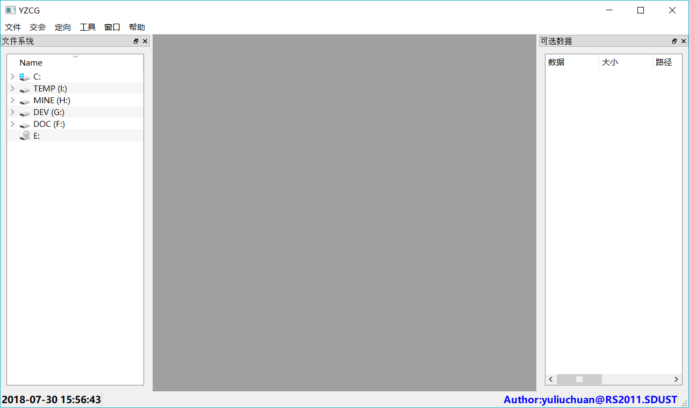
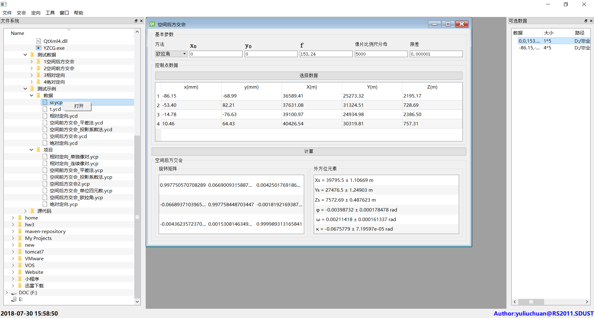
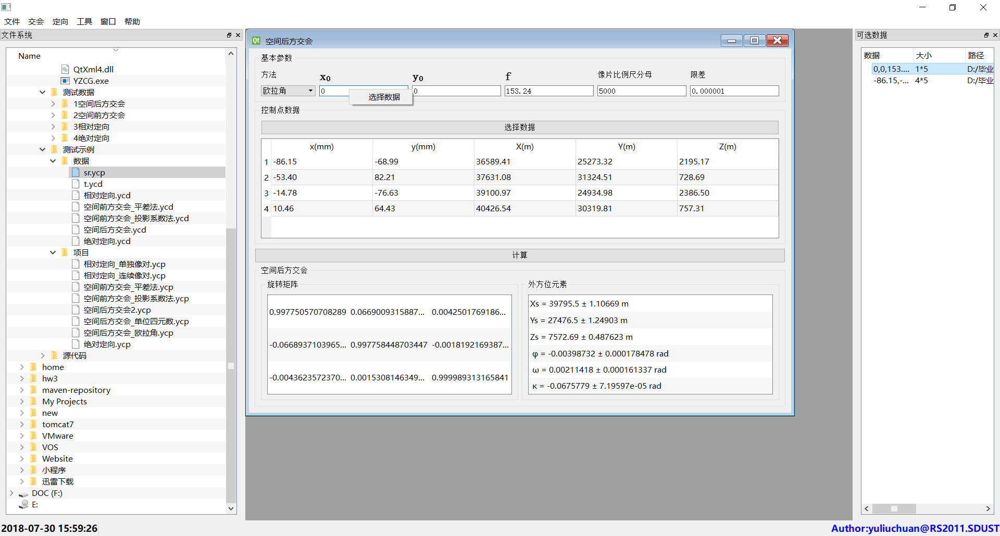
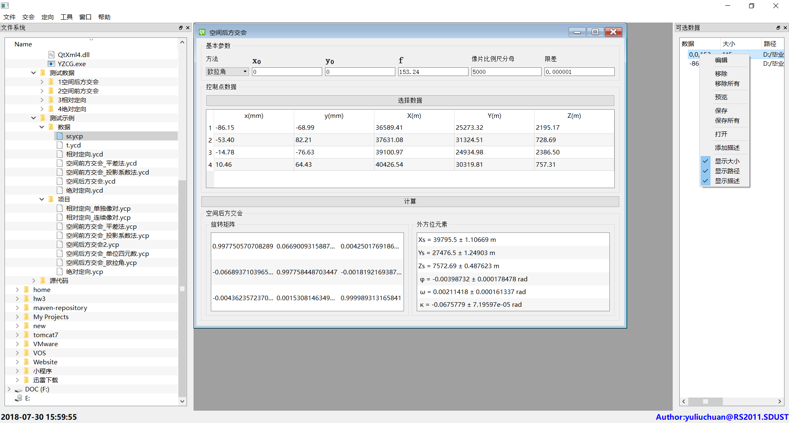
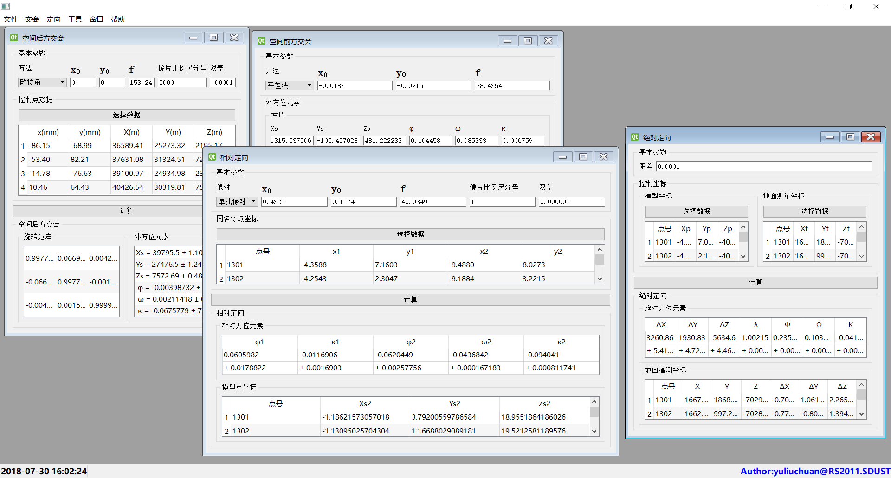
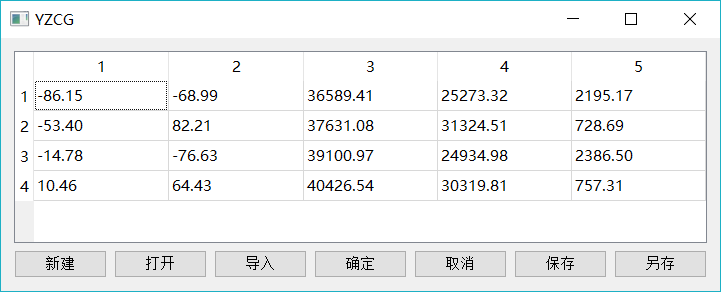
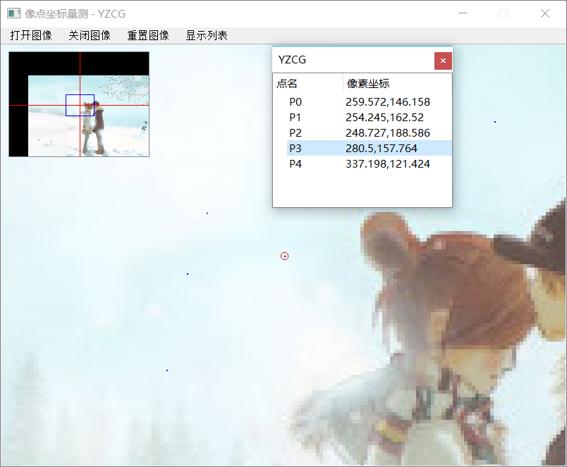

# YZCG
## （毕业设计）基于Qt的摄影测量基础算法的设计与实现

## 实现功能
* 空间后方交会

* 空间前方交会

* 相对定向

* 绝对定向

* 像点坐标量测

* 项目的保存与打开

* 数据的处理

## 运行截图

* 启动界面

* 文件系统操作

* 选择数据

* 数据操作

* 交会和定向

* 数据编辑

* 像点坐标量测

* 关于

--------------------------------------------
毕业设计题目：
	基于Qt的摄影测量基础算法的设计与实现

设计人：
	于留传201101180723

指导老师：
	王仁礼

设计人学校：
	山东科技大学

设计人学院：
	测绘科学与工程学院

设计人专业：
	遥感科学与技术2011-1班
	
				于留传
			2015年6月16日@J6-366				
--------------------------------------------
